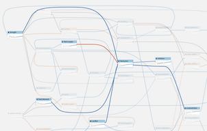
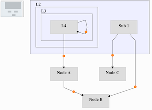

## svg-flowgraph
svg-flowgraph provides the basic blueprints for doing customizable renderings for small-to-medium graphs (up to ~500 nodes). It provides the scaffolding, data management, and utilities to abstract out the common chores for building interactive graphs so you can focus on the rendering aspect.

Note svg-flowgraph is _NOT_ a layout engine, you need to write your own layout heuristics, or use an off-the-shelf algorithm. We have used svg-flowgraph with ELK-JS (https://github.com/kieler/elkjs).



The example provided here uses Dagre (https://github.com/dagrejs/dagre).




### API and modules
Initialization
- el: Container element
- adapter: Adapter instance
- useEdgeControl: Whether to allocate an additional interactive element to an edge.
- useMinimap: Whether to show the mini-map
- useZoom: Whether to enable user initiated zoom/pan
- addons: List of additional modules

```
class MytRenderer extends SVGRenderer {
  ...
}

// Create renderer
const renderer = new MyRenderer({
  el: document.getElementById('test'),
  adapter: new DAGREAdapter({ nodeWidth: 100, nodeHeight: 50 }),
  renderMode: 'basic',
  useEdgeControl: true,
  useMinimap: true,
  addons: [ group, nodeSize, highlight, nodeDrag, expandCollapse, panZoom ]
});

// Run
renderer.setData(graph);
renderer.render().then(() => {
  // Call an add-on function
  renderer.enableDrag(true);
});

```

Addons
- expandCollapse: Expand/collapse nested groups
- group: Create artificial nested groups
- highlight: Gaussian blur highlights
- nodeDrag: Node dragging
- nodeSize: Node resizing
- panZoom: Programmatic navigation


### Build
Build into dist
```
npm run build
```

### Test/Demo
```
npm run dev
```
